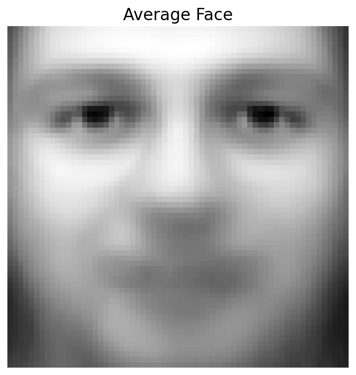
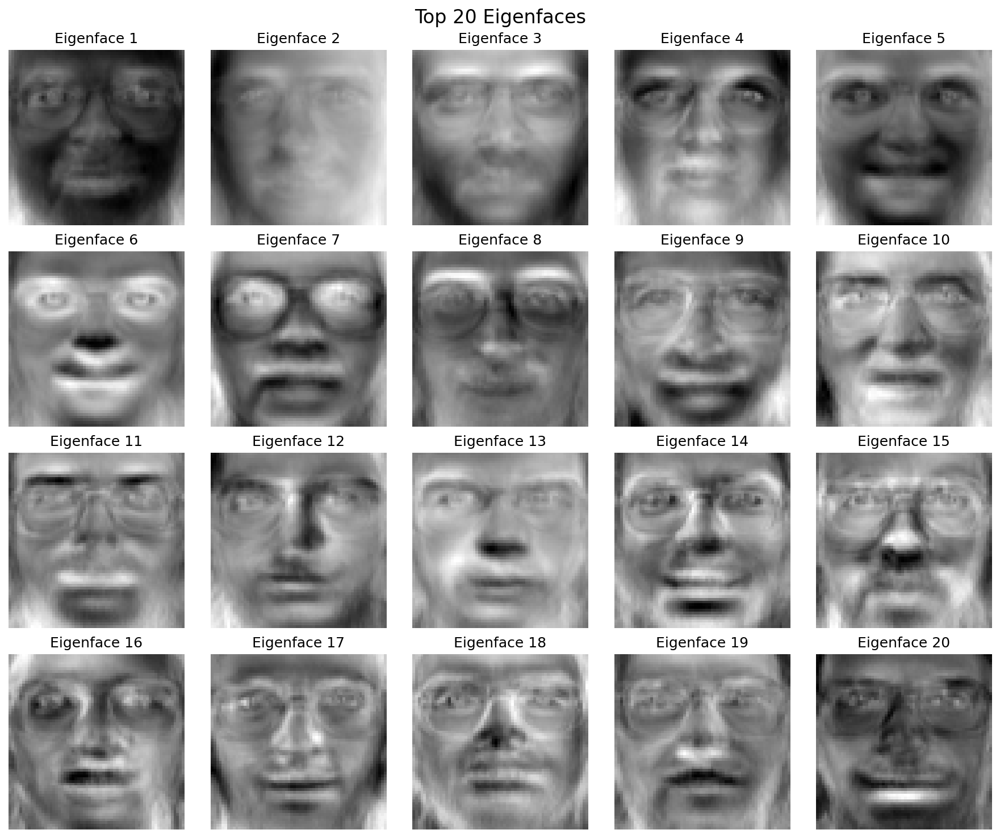

# Eigenface Face Recognition

A Python implementation of the classical Eigenface algorithm for face recognition using Principal Component Analysis (PCA).


## Overview

This project implements face recognition using eigenfaces, a classical computer vision technique that uses PCA to reduce facial images to their principal components. The implementation achieves **88.8% accuracy** on the Olivetti faces dataset.

## Features

- Implementation of PCA from scratch using eigendecomposition
- Efficient computation using the "snapshot method" for high-dimensional data
- Face recognition using nearest neighbor classification in eigenspace
- Visualization of eigenfaces and mean face
- Performance analysis across different numbers of principal components

## Results

| Metric | Value |
|--------|-------|
| Recognition Accuracy | 88.8% |
| Training Samples | 320 (8 per person) |
| Test Samples | 80 (2 per person) |
| Number of Eigenfaces | 50 |
| Training Time | < 1 second |

### Visualizations

<div align="center">
  
  <p><em>Average face computed from training data</em></p>
</div>

<div align="center">
  
  <p><em>Top 20 eigenfaces showing principal modes of facial variation</em></p>
</div>

## Installation

```bash
# Clone the repository
git clone https://github.com/johnny-crawford/EigenFace.git
cd eigenface-recognition

# Install dependencies
pip install -r requirements.txt
Usage
bashpython eigenface.py
Example Output:
Loading Olivetti faces dataset...
Loaded 320 training and 80 test images

Computing eigenfaces...
Computed 50 eigenfaces

Visualizing results...
[Displays mean face and eigenfaces]

Projecting faces onto eigenspace...

Performing face recognition...

Results:
Overall accuracy: 88.8%
Correctly recognized: 71 out of 80 faces
Project Structure
eigenface-recognition/
├── eigenface.py          # Main implementation
├── README.md            # Project documentation
├── requirements.txt     # Python dependencies
└── results/            # Output visualizations
    ├── mean_face.png
    └── eigenfaces_grid.png

How It Works

Data Preprocessing: Center face images by subtracting the mean face
PCA Computation: Calculate covariance matrix and find eigenvectors
Dimensionality Reduction: Project faces onto top k eigenvectors (eigenfaces)
Recognition: Classify test faces using nearest neighbor in reduced space

Mathematical Foundation
The algorithm computes eigenfaces by solving:
C·v = λ·v
where C is the covariance matrix, v are eigenvectors (eigenfaces), and λ are eigenvalues.
Performance Analysis
The recognition accuracy varies with the number of eigenfaces used:
<div align="center">
  
</div>
Future Improvements

 Implement k-NN classification instead of 1-NN
 Add support for real-time face recognition via webcam
 Compare with modern deep learning approaches (FaceNet, VGGFace)
 Add data augmentation for improved robustness
 Implement LDA (Linear Discriminant Analysis) for comparison

Contributing
Contributions are welcome! Please feel free to submit a Pull Request.
License
This project is licensed under the MIT License - see the LICENSE file for details.
Acknowledgments

Olivetti faces dataset from AT&T Laboratories Cambridge
Original Eigenface paper: Turk, M., & Pentland, A. (1991). "Eigenfaces for recognition"

Contact
Johnny Crawford - https://www.linkedin.com/in/johnny-crawford/ - j.craw1306@gmail.com

If you found this project helpful, please consider giving it a star!
